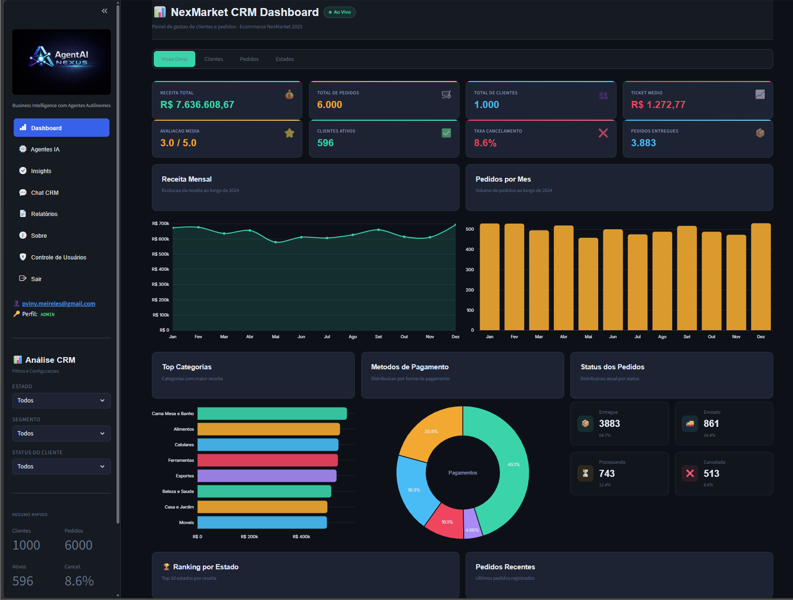
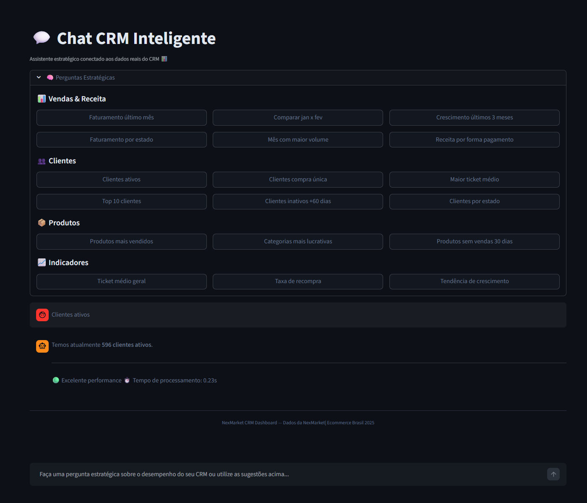
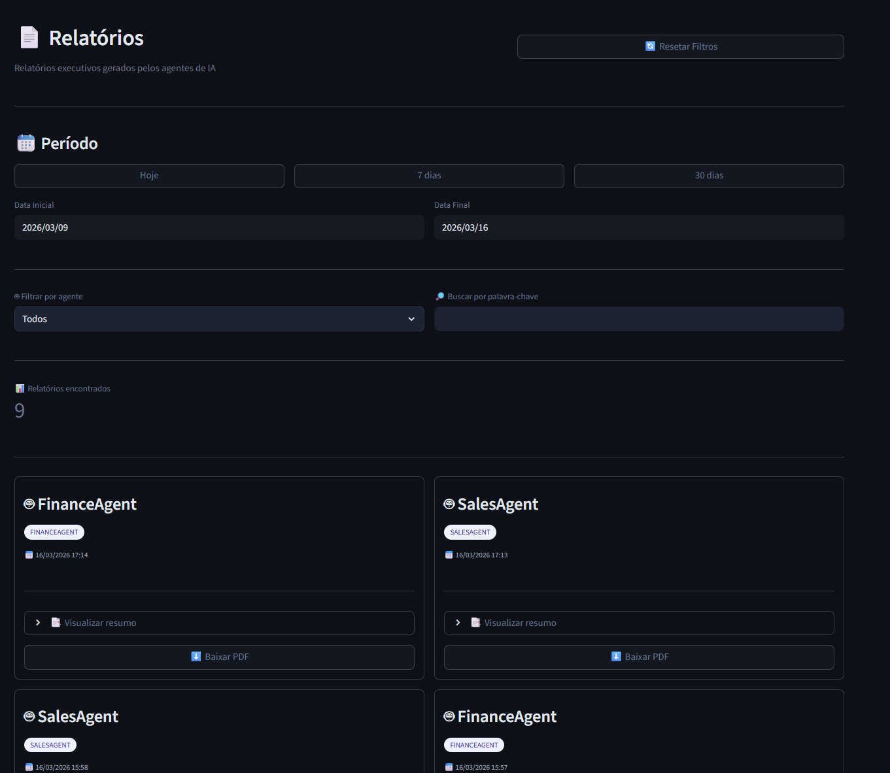

# 🚀 AgentAI Nexus


**AgentAI Nexus** é uma plataforma de **CRM Inteligente com Multi‑Agentes de IA**, dashboards analíticos e chat em linguagem natural para apoiar decisões comerciais e estratégicas em tempo real.

A solução transforma dados de **clientes, pedidos, produtos e pagamentos** em **insights acionáveis**, combinando Business Intelligence, Inteligência Artificial e automação analítica.

---

# 📊 Visão Geral

O AgentAI Nexus foi projetado para ajudar empresas a **entender, monitorar e otimizar suas operações comerciais** através da análise inteligente de dados.

A plataforma conecta:

- dados de clientes
- pedidos
- produtos
- pagamentos
- receita

com uma camada de **Inteligência Artificial capaz de interpretar métricas e gerar análises estratégicas automaticamente.**

Mais do que dashboards, o sistema entrega **decisões orientadas por IA.**

---

# 🧠 Principais Funcionalidades

## 🤖 Arquitetura Multi‑Agente

A plataforma foi projetada para operar com agentes especializados que analisam diferentes dimensões do negócio.

| Agente | Responsabilidade |
|------|------|
| Sales Agent | análise de vendas e faturamento |
| Customer Agent | análise de clientes |
| Growth Agent | tendências e crescimento |
| Finance Agent | análise financeira |
| Orchestrator | coordenação das análises |

Esses agentes trabalham sobre o banco de dados e produzem **insights estratégicos automaticamente.**

---

## 💬 Chat CRM Inteligente

O usuário pode consultar o banco de dados em **linguagem natural**.

Exemplos de perguntas:

```
Como estão minhas vendas?
Quantos clientes ativos temos?
Qual foi o faturamento do último mês?
Quais produtos mais vendem?
Qual a tendência de crescimento?
```

O sistema interpreta a pergunta, executa consultas SQL e retorna **análises estratégicas geradas por IA.**

---

## 📊 Dashboard Analítico

A aplicação oferece dashboards com métricas como:

- Receita total
- Total de pedidos
- Ticket médio
- Clientes ativos
- Receita por estado
- Receita por categoria
- Evolução de vendas
- Performance de produtos

Esses indicadores permitem acompanhar a **saúde comercial do negócio em tempo real.**

---

## 📄 Relatórios Automatizados

O sistema gera **relatórios executivos em PDF** contendo:

- análise de vendas
- insights estratégicos
- recomendações de negócio
- layout profissional

Os relatórios são pensados para **gestores, executivos e diretores.**

---

# 🏗 Arquitetura da Plataforma

```
                ┌────────────────────┐
                │     Streamlit UI   │
                │  Dashboards + Chat │
                └─────────┬──────────┘
                          │
                          ▼
                 ┌─────────────────┐
                 │  Orchestrator   │
                 │     Agent       │
                 └───────┬─────────┘
                         │
     ┌──────────────┬──────────────┬──────────────┐
     ▼              ▼              ▼              ▼
Sales Agent   Customer Agent   Growth Agent   Finance Agent

                         │
                         ▼
                   SQL Tool Layer
                         │
                         ▼
                PostgreSQL / Supabase
```

---

# ⚙️ Stack Tecnológico

| Tecnologia | Uso |
|------|------|
| Python | backend e agentes |
| Streamlit | interface web |
| Supabase | banco de dados |
| PostgreSQL | armazenamento |
| LLM | análise inteligente |
| Pandas | manipulação de dados |
| CrewAI | arquitetura multi‑agente |
| ReportLab | geração de PDF |

---

# 📂 Estrutura do Projeto

```
AgentAI Nexus
│
├── core
│   ├── agents
│   │   ├── sales_agent.py
│   │   ├── finance_agent.py
│   │   ├── customer_agent.py
│   │   └── growth_agent.py
│   │
│   ├── orchestrator.py
│   └── tools
│       └── sql_tool.py
│
├── services
│   └── report_service.py
│
├── utils
│   └── pdf.py
│
├── page
│   ├── dashboard.py
│   ├── chat.py
│   ├── reports.py
│   └── sobre.py
│
├── reports
│   └── Relatorio_Executivo.pdf
│
└── app.py
```

---

# 🧪 Exemplos de Insights Gerados

O AgentAI Nexus pode gerar análises como:

### 📈 Análise de vendas

- crescimento de receita
- comparação entre períodos
- desempenho por estado

### 👥 Análise de clientes

- clientes ativos
- taxa de recompra
- clientes inativos

### 🛍 Produtos

- produtos mais vendidos
- produtos sem vendas
- categorias mais lucrativas

---

# 🏢 Contexto de Negócio

O sistema utiliza como contexto de negócio a empresa fictícia **NexMarket**, fundada em **2022**.

A empresa representa uma operação moderna de vendas de produtos e serviços com forte foco em relacionamento com clientes.

### Missão

Facilitar a conexão entre vendedores e clientes, promovendo eficiência, transparência e crescimento.

### Visão

Ser referência nacional em soluções de mercado orientadas por dados.

### Valores

- inovação
- transparência
- excelência
- sustentabilidade
- foco no cliente

---

# 🧭 Roadmap

Possíveis evoluções da plataforma:

- autenticação de usuários
- arquitetura SaaS multiempresa
- insights preditivos
- alertas inteligentes
- automações comerciais
- migração para React + FastAPI
- dashboards avançados
- integração com APIs externas

---

# 📷 Screenshots

Sugestão de adicionar ao repositório:

```
/assets/dashboard.png
/assets/chat.png
/assets/relatorio.png
```

E no README:

```





```

---

# 👨‍💻 Autor

**Vinicius Meireles**  
Founder — **VIMEUP AI Solutions**

Especialista em:

- Engenharia de IA
- Sistemas Multi‑Agentes
- Data Science
- Arquiteturas Inteligentes

---

# ⭐ Apoie o Projeto

Se este projeto foi útil para você:

⭐ Deixe uma estrela no repositório  
📢 Compartilhe com a comunidade

